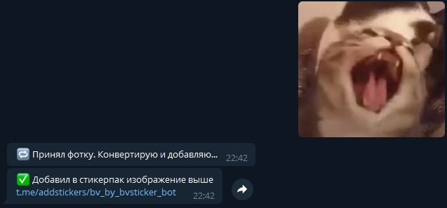
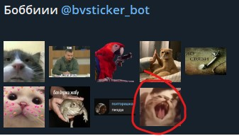

# This Telegram bot adds any sent photo or image sticker to your OWN STICKERPACK created BY THIS BOT.

# How it works?
You will give the bot a sticker, picture or transparent image as a file, and I add it to the owner's sticker pack.

# What is the advantage of this bot?
Other bots can only add other stickers to your sticker pack. This one converts any picture, sticker or * .png file into a sticker and adds it to the sticker pack.
It can be used for general chat, where anyone can drop a picture, and the owner will only have to confirm adding the sticker

# Working example: 

# Installation: 
  - Download Python 3+
  - In the terminal enter the command `pip install pyTelegramBotAPI`
  - Create bot here https://t.me/BotFather and copy it's Token
  - Download latest release
  - Run `sticker_bot.py`. It will ask you to write bot token. Restart bot and if ok, it will print `BOT: Started...`

# User guide: 
  - Sticker pack must be created by bot. Create it using `/css` command
  - Send sticker, photo or png file and bot will add it to your stickerpack really faster than usual "Stickers" bot. You also dont need to convert your images by yourself to follow 512px width image rule. Bot will do it :D

